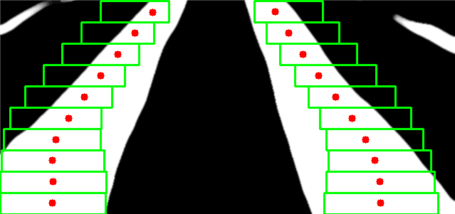
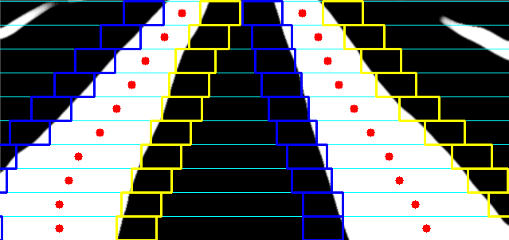
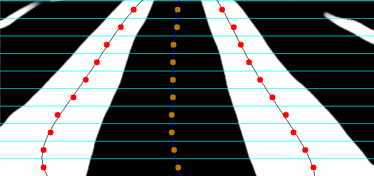

# Ridgepath-Path-Planning-with-Adaptive-MicroROI

## 项目简介

该项目旨在探索自适应微型ROI路径规划技术，通过不同的方法优化导航点的选择和路径的平滑性。

## 文件说明

- **adaptiveROI_v1.py**: 
  - 这是项目的第一版本。
  - 使用基于最大化白色像素的方式寻找导航点。
  - 

- **adaptiveROI_v2.py**: 
  - 采用自适应微型子ROI方式。
  - 动态寻找边界，平滑导航线的提取。
  - 
  - 

- **extraction_label.py**: 
  - 实现垂直投影寻找算法的初始迭代点。
  - 调用 `find_startpoints` 类中的方法。

